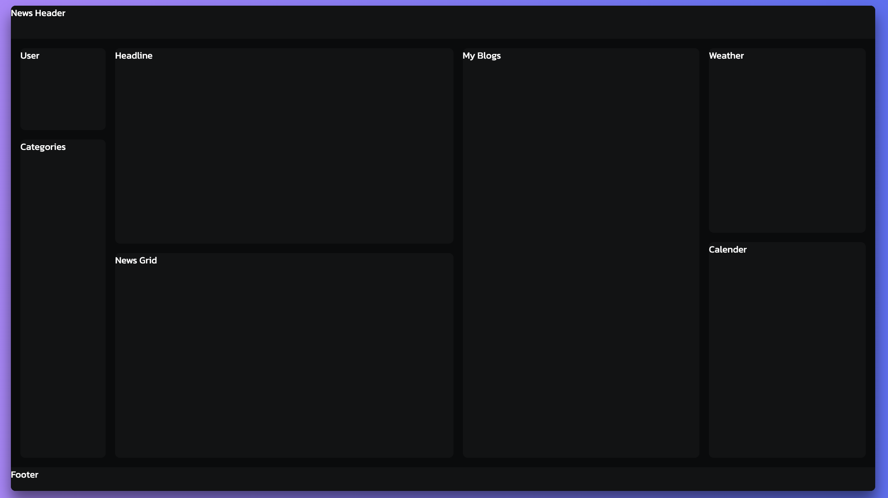

# News and Blogs

## Overview

- The News & Blogs Website is a modern, full-featured web application built with React that combines real-time global news updates with personal blogging capabilities. The platform provides users with an engaging space to read, explore, and create content — all within a sleek, responsive, and dark-themed interface.

- The home page presents a visually rich dashboard featuring:

  - Latest News Section: A dynamic feed displaying top headlines and category-based articles fetched from live APIs.

  - Featured Article: A large, prominent story designed to capture user attention.

  - Category Sidebar: Easy navigation across topics like Business, Technology, Sports, Health, and more.

  - My Blogs Section: Personalized space where users can create, edit, and view their own blog posts.

  - Weather & Calendar Widgets: Real-time weather updates and an interactive calendar for improved user engagement.

- Users can also search for news, bookmark favorite articles, and filter content based on interest — ensuring a personalized reading experience.

- Designed with a focus on usability, interactivity, and aesthetics, the News & Blogs platform offers a seamless blend of news consumption and content creation, making it both informative and social.

## Design and Layout for the website



## System Components

- NewsFeed: Displays list/grid of articles.
- CategorySidebar: List of categories (General, World, Tech, etc.).
- NewsCard: Individual article card (image, title, short desc, bookmark icon).
- SearchBar: For searching specific news titles.
- WeatherWidget: Shows current weather (e.g., Tbilisi - 30°C Clear).
- CalendarWidget: Displays date and highlights current day.
- MyBlogsSection: Displays personal blog posts (user-created content).

## Core Objective

- The News section should:
  - Fetch and display categorized news articles.
  - Allow users to search, filter by category, and bookmark.
  - Show trending or recent articles prominently.
  - Support dynamic updates (new articles, weather, date, etc.).

Features & API Usage

- HTTP Client: Using Axios to make HTTP requests from React components.

- Promise-based, simple syntax, and handles errors easily.

- Installed via:

```shell
npm install axios
```

- News API: Using GNews API to fetch latest news articles.

- Provides global news headlines and articles.

- Requires an API key (free plan available).

- Official website: https://gnews.io

### Errors For News Components

1. Uncaught Error: Objects are not valid as a React child (found: object with keys {id, title, description, content, url, image, publishedAt, lang, source}). If you meant to render a collection of children, use an array instead.

- Conditional Rendering
- While fetching data from api and display the headline
- Fix :
  - You only render when headline exists (headline && ... avoids null errors).
  - You show proper fields like image, title, and description.

```js
{
  headline && (
    <div className="headline">
      
      <h2 className="headline-title">
        {headline.title}
        <i className="fa-regular fa-bookmark bookmark"></i>
      </h2>
      <p>{headline.description}</p>
    </div>
  );
}
```

2. Even after on clicking category it was not updating so update the api url to handle dynamic selectedCategory

```js
const gnewsURL = `https://gnews.io/api/v4/top-headlines?category=${selectedCategory}&lang=en&apikey=e44e09001f7655277af07cd5512bf391`;
```

3. Handling Missing or Broken Images and Empty News Results

- To make the news feed UI more robust, I implemented several checks and fallbacks for cases where the GNews API returns incomplete or invalid data.

- Problem :

  - The GNews API sometimes returns:
    - Articles without images (image: null)
    - Invalid/broken image URLs
    - Empty results for a given category or search query

- Solution :

  - 1. Fallback Image Handling

    - Used a local placeholder image noImg whenever an article had no valid image field.
    - Added an onError handler to  tags to replace broken or invalid URLs dynamically:

    ```js
    onError={(e) => {
      e.target.onerror = null;
      e.target.src = noImg;
    }}

    ```

    - This ensures that every article always displays a valid image, even if the original URL fails.

  - 2.  Default Image Assignment in API Response

        - After fetching data, each article’s image field is checked.
        - If missing, replaced immediately with noImg before setting state:

        ```js
        const cleanedNews = fetchedNews.map((article) => ({
          ...article,
          image: article.image || noImg,
        }));
        ```

  - 3. Graceful Handling for Empty Results

    - If the API returns zero articles:
      - Headline is set to null.
      - News grid is cleared.
      - A message "No articles found for this search." is displayed to the user.

  - 4. Conditional rendering used for:

    - Showing the headline only if it exists.
    - Showing the news grid only when news.length > 0.
    - Displaying a fallback message otherwise.

  - 5.  Improved User Experience

    - Prevents layout breaks or console errors caused by undefined values.
    - Guarantees a consistent design, even with incomplete API responses.

      ```js
       {
          e.target.onerror = null;
          e.target.src = noImg;
        }}
      />
      ```

4. Handling GNews API Limits and Errors

- To ensure a smooth user experience even when the API fails or limits are reached, I added detailed error handling:

  - 403 Error (Forbidden) →

    - → Shown message: “⚠️ Daily API request limit reached or invalid API key. Please try again later.”

  - 429 Error (Too Many Requests) →

    - → Shown message: “🚫 Too many requests! Please wait a moment before trying again.”

  - Network Failure →

    - → Shown message: “⚠️ Network error. Please check your connection.”

  - Empty Results →
    - → Shown message: “No articles found for this search.”

### Errors For Weather Components

## Blog Section

### Functionality

1. CRUD

- Create Blog - Form Component
- Read Blog -> Modal Box
- Update Blog -> Edit button
- Delete Blog -> Delete button

2. HTML for BLOG creation

```jsx
import userImg from "../assets/images/user.jpeg";
export default function Blogs() {
  return (
    <div className="blogs">
      <div className="blog-left">
        
      </div>
      <div className="blog-right">
        <button className="post-btn">Create New Post</button>
        <button className="blog-close-btn">
          Back
          <i className="bx bx-chevron-right"></i>
        </button>
      </div>
    </div>
  );
}
```

3. Adding form to blog component

```jsx
import userImg from "../assets/images/user.jpeg";
import "./Blogs.css";
export default function Blogs() {
  return (
    <div className="blogs">
      <div className="blog-left">
        
      </div>
      <div className="blog-right">
        {/* <button className="post-btn">Create New Post</button> */}

        {/* Form Element  */}
        <div className="blog-right-form">
          <h1>New Post</h1>
          <form>
            <div className="img-upload">
              <label htmlFor="file-upload" className=".file-upload">
                <i className="bx bx-upload"></i>Upload Image
              </label>
              {/* id attribute should match the html for attribute */}
              <input type="file" id="file-upload" />
            </div>
            <input
              type="text"
              placeholder="Add Title (Max 60 character)"
              className="title-input"
            />

            <textarea className="text-input" placeholder="Add Text"></textarea>
            <button type="submit" className="submit-btn"></button>
          </form>
        </div>

        <button className="blog-close-btn">
          Back
          <i className="bx bx-chevron-right"></i>
        </button>
      </div>
    </div>
  );
}
```

4. Styling Blog Component

```css
.blogs {
  width: 100%;
  height: 100%;
  display: flex;
}
.blog-left {
  width: 50%;
  height: 100%;
  background: linear-gradient(
      rgba(184, 142, 252, 0.3),
      rgba(104, 119, 244, 0.2)
    ), url("../assets/images/bg.jpg");
  background-size: cover;

  border-radius: 1rem 0 0 1rem;
  position: relative;
}
.blog-left img {
  width: 15rem;
  aspect-ratio: 1;
  object-fit: conver;
  border-radius: 50%;
  border: 0.3rem solid #6877f4;
  position: absolute;
  top: 50%;
  right: -7.5%;
  transform: translateY(-50%);
}

.blog-right {
  width: 50%;
  height: 100%;
  display: flex;
  justify-content: center;
  align-items: center;

  position: relative;
}
.blog-close-btn {
  position: absolute;
  top: 3rem;
  right: 2.5rem;
  background: transparent;
  border: none;
  font-family: "Bebus Neue", sans-serif;
  font-size: 3rem;
  color: #ddd;
  /* Aligment of icon  */
  display: flex;
  align-items: center;
  cursor: pointer;
}
.blog-close-btn i {
  font-size: 3.5rem;
}
.post-btn {
  width: clamp(15rem, 16cqi, 30rem);
  aspect-ratio: 4/1;
  background: linear-gradient(to right, #b88efc, #6877f4);
  border: none;
  border-radius: 5rem;
  font-size: 2.5rem;
  text-transform: uppercase;
  color: #fff;
  text-shadow: 0 0.5rem 1rem rgba(0, 0, 0, 0.2);
  cursor: pointer;
}
.post-btn:active {
  transform: translateY(0.2rem);
}

/* Styling form in blog  */
.blog-right-form {
  display: flex;
  flex-direction: column;
  align-items: center;
  row-gap: 5rem;
}

.blog-right-form h1 {
  font-family: "Comfortaa", sans-serif;
  font-size: clamp(2rem, 5cqi, 6rem);
  text-transform: uppercase;
  background: linear-gradient(to right, #b88efc, #6877f4);
  -webkit-background-clip: text;
  -webkit-text-fill-color: transparent;
}

.blog-right-form form {
  display: flex;
  flex-direction: column;
  row-gap: 4rem;
}
.file-upload {
  display: flex;
  align-items: center;
  column-gap: 2rem;
  font-size: 2rem;
  color: #bbb;
  cursor: pointer;
}
.file-upload i {
  font-size: 4rem;
  color: #b88efc;
}
.blog-right-form input[type="file"] {
  display: none;
}

.title-input,
.text-input {
  width: clamp(15rem, 25cqi, 45rem);
  background: transparent;
  border: none;
  border-bottom: 0.1rem solid #b88efc;
  padding: 2rem 0;
  color: #ddd;
}
.title-input {
  font-size: 1.8rem;
}
.text-input {
  aspect-ratio: 5/3;
  resize: none;
}
.title-input::placeholder,
.text-input::placeholder {
  font-family: "Comfortaa", sans-serif;
  font-size: 1.3rem;
  color: #b88efc;
  opacity: 0.5;
}
.title-input::placeholder {
  font-size: 1.6rem;
}
.title-input:focus::placeholder,
.text-input:focus::placeholder {
  color: transparent;
}

.submit-btn {
  height: 5rem;
  background: linear-gradient(to left, #b88efc, #6877f4);
  border: none;
  border-radius: 5rem;
  font-size: 1.8rem;
  color: #fff;
  text-transform: uppercase;
  letter-spacing: 0.1rem;
  text-shadow: 0 0.5rem 1rem rgba(0, 0, 0, 0.2);
  cursor: pointer;
}
.submit-btn:active {
  transform: translateY(0.2rem);
}
```

5. Handle Navigation between News and Blog component

- create states and function to show visiblity of news and blog component in App.jsx file

```jsx
const [showNews, setShowNews] = useState(true);
const [showBlogs, setShowBlogs] = useState(false);

// Function to handle show blogs component
const handleShowBlogs = () => {
  setShowNews(false);
  setShowBlogs(true);
};
// Function to handle show news component
const handleBackToNews = () => {
  setShowBlogs(false);
  setShowNews(true);
};
return (
  <div className="container">
    <div className="news-and-blog">
      {showNews && <News onShowBlogs={handleShowBlogs} />}
      {showBlogs && <Blogs onBack={handleBackToNews} />}
    </div>
  </div>
);
```

- In News.jsx take this prop

```jsx
export default function News({ onShowBlogs }) {
  //.....Content
}
```

- When user click on the User div/section then trigger the onShowBlogs, this will show the blog section

```html
<div className="user" onClick="{onShowBlogs}">
  {/* To use image in react we need to import it */}
  
  <p>Utkarsh's Blog</p>
</div>
```

- In Blog.jsx file take the prop

```jsx
export default function Blogs({ onBack }) {
  // .....Content
}
```

- When User Click on the Back Navigate back to News Component

```html
<button className="blog-close-btn" onClick="{onBack}">
  Back
  <i className="bx bx-chevron-right"></i>
</button>
```

6. Handle Visibility of form in Blog Component

- Create state for managing the visibility of blog component

```jsx
// State to manage form visibility
// on clicking create new post form should be visible
const [showForm, setShowForm] = useState(false);
```

- Based on state variable add conditional rendering to show and hide the form

```jsx
{
  showForm ? (
    // {/* Form Element  */}
    <div className="blog-right-form">
      <h1>New Post</h1>
      <form>
        <div className="img-upload">
          <label htmlFor="file-upload" className="file-upload">
            <i className="bx bx-upload"></i>Upload Image
          </label>
          {/* id attribute should match the html for attribute */}
          <input type="file" id="file-upload" />
        </div>
        <input
          type="text"
          placeholder="Add Title (Max 60 character)"
          className="title-input"
        />

        <textarea className="text-input" placeholder="Add Text"></textarea>
        <button type="submit" className="submit-btn">
          Submit Button
        </button>
      </form>
    </div>
  ) : (
    <button className="post-btn" onClick={() => setShowForm(true)}>
      Create New Post
    </button>
  );
}
```

7. Layout and Styling of My Blog section in News Component

- Structure of MyBlog section

```html
{/* My Blog section */}
<div className="my-blogs">
  <h1 className="my-blogs-heading">My Blogs</h1>
  <div className="blog-posts">
    <div className="blog-post">
      
      <h3>Lorem ipsum dolor sit.</h3>
      {/* Edit and Delete Button */}
      <div className="post-buttons">
        <button className="edit-post">
          <i className="bx bxs-edit"></i>
        </button>
        <button className="edit-post">
          <i className="bx bxs-x-circle"></i>
        </button>
      </div>
    </div>
    <div className="blog-post">
      
      <h3>Lorem ipsum dolor sit.</h3>
      {/* Edit and Delete Button */}
      <div className="post-buttons">
        <button className="edit-post">
          <i className="bx bxs-edit"></i>
        </button>
        <button className="edit-post">
          <i className="bx bxs-x-circle"></i>
        </button>
      </div>
    </div>
    <div className="blog-post">
      
      <h3>Lorem ipsum dolor sit.</h3>
      {/* Edit and Delete Button */}
      <div className="post-buttons">
        <button className="edit-post">
          <i className="bx bxs-edit"></i>
        </button>
        <button className="edit-post">
          <i className="bx bxs-x-circle"></i>
        </button>
      </div>
    </div>
  </div>
</div>
```

- Styling of My Blog section

```css
/* ************************************ My Blog Section ********************************************* */
/* Styling My Blog section */
.my-blogs {
  width: clamp(20rem, 27cqi, 28%);
  height: 100%;
  background-color: #111214;
  border-radius: 1rem;
  display: flex;
  flex-direction: column;
  row-gap: 3rem;
  padding-bottom: 2rem;
}
.my-blogs-heading {
  font-family: "Bebus Neue", sans-serif;
  font-size: 3rem;
  color: #ddd;
  letter-spacing: 0.1rem;
  padding: 2rem;
}
.blog-post {
  flex: 0 1 calc(50% - 0.6rem);
  border-radius: 1rem;
  position: relative;
}
.blog-posts {
  display: flex;
  flex-wrap: wrap;
  justify-content: space-between;
  gap: 1.2rem;
  padding: 1.2rem;
}

.blog-posts img {
  width: 100%;
  height: 100%;
  object-fit: conver;
  border-radius: 1rem;
  opacity: 0.5;
}
.blog-post h3 {
  width: 100%;
  position: absolute;
  bottom: 0;
  left: 0;
  padding: 1rem;
  background-color: rgba(0, 0, 0, 0.7);
  border-radius: 0 0 1rem 1rem;
  font-size: 1.6rem;
  font-weight: 300;
  text-transform: uppercase;
  line-height: 1.6rem;
  color: #fff;
  /* Long word will break to new line  */
  overflow-wrap: break-word;
}

.post-buttons {
  position: absolute;
  top: 1rem;
  right: 1rem;
  display: flex;
  justify-content: center;
  column-gap: 2rem;

  /* Hide the button Initially, Show them once user hover  */
  opacity: 0;
  visibility: hidden;
  transition: all 0.3s;
}
/* Hide the button Initially, Show them once user hover  */
.blog-post:hover .post-buttons {
  opacity: 1;
  visibility: visible;
}

.post-buttons button {
  background-color: transparent;
  border: none;
  font-size: 2.5rem;
  color: #fff;
  cursor: pointer;
}
```

7. Handling the Submission of new post created and Displaying them in My Blog section in News Component

- User will create a new blog by clicking the create post
- Creating state to store the new blog added in App.jsx

```jsx
// State to manage and store  blogs that user creates
const [blogs, setBlogs] = useState([]);
```

- Create a function to handle Addition of new blog created

```jsx
// This function handles to add a new blog to the blogs state
const handleCreateBlog = (newBlog) => {
  setBlogs((prevBlogs) => [...prevBlogs, newBlog]);
};
```

- passing the blogs state variable to News Component which will help in displaying the blogs in My Blogs Section

```jsx
{
  showNews && <News onShowBlogs={handleShowBlogs} blogs={blogs} />;
}
```

- passing the handleCreateBlog function to Blog Component which will help in adding new blog on submission

```jsx
{
  showBlogs && (
    <Blogs onBack={handleBackToNews} onCreateBlog={handleCreateBlog} />
  );
}
```

- Receiving the prop passed from App component to Blog Component in Blog.jsx

```jsx
export default function Blogs({ onBack, onCreateBlog }) {
  // ...Content
}
```

- Creating state variable to handle image, image name uploaded, title, content of blog post created

```jsx
// State to hold data of image when user create a new blog post
const [image, setImage] = useState(null);

// State to handle Image name to show what Image uploaded
const [imgName, setImgName] = useState("");

// State to hold title of blog post which user create
const [blogTitle, setBlogTitle] = useState("");

// State to hold content of blog post which user create
const [content, setContent] = useState("");
```

- Create a function which handles the image upload
- It will set the image state and image name state

```jsx
// This function handles the image upload process
const handleImageChange = (evt) => {
  const file = evt.target.files[0];
  // This condition checks if there are any file selected by user
  if (evt.target.files && evt.target.files[0]) {
    setImgName(file.name);
    // FileReader - The file reader object allows us to read the contents of files stored on the user's computer.
    // It provides methods to read file data in various formats, such as text or base64 encoded strings.
    const reader = new FileReader();
    reader.onloadend = () => {
      // The reader.result property contains the base64 encoded data of the selected image file.
      setImage(reader.result);
    };
    // The readAsDataURL method reads the contents of the file and converts it into a base64 encoded string.
    // Converting the file into a base64 encoded string allows us to use the image data directly in our HTML
    // as a data URL.
    reader.readAsDataURL(evt.target.files[0]);
  }
};
```

- Now Create a function to handle form submission when User press submit
- This function will :
  - create the new blog object
  - update the state in App component through onCreateBlog(newBlog);
  - reset the form state

```jsx
// This function handles the user submission of form
// When user create new blog post it will gather all the input
// and return new blog post object and update state
const handleSubmit = (evt) => {
  //prevent default behaviour - page realod on submission of form
  evt.preventDefault();
  const newBlog = {
    image: image || noImg,
    blogTitle,
    content,
  };
  onCreateBlog(newBlog); // state updated in App content

  // clear the form fields
  setImage(null);
  setBlogTitle("");
  setContent("");

  // Hide the form after submission
  setShowForm(false);
};
```

- Update the JSX now for the form element
  - pass function handleSubmit to form element
  - pass function handleImageChange to input field of image upload
  - show the image name uploaded
  - add value and onChange function to Blog Title
  - add value and onChange function to textarea

```jsx
<form onSubmit={handleSubmit}>
  <div className="img-upload">
    <label htmlFor="file-upload" className="file-upload">
      <i className="bx bx-upload"></i>Upload Image
    </label>
    {/* id attribute should match the html for attribute */}
    <input type="file" id="file-upload" onChange={handleImageChange} />

    {/* ✅ Show uploaded image name only */}
    {imgName && <p className="image-name">Uploaded image : {imgName}</p>}
  </div>

  <input
    type="text"
    placeholder="Add Title (Max 60 character)"
    className="title-input"
    value={blogTitle}
    onChange={(evt) => setBlogTitle(evt.target.value)}
  />

  <textarea
    className="text-input"
    placeholder="Add Text"
    value={content}
    onChange={(evt) => setContent(evt.target.value)}
  ></textarea>
  <button type="submit" className="submit-btn">
    Submit Button
  </button>
</form>
```

- Css for image upload

```css
/* Styling image name after upload  */
.image-name {
  margin-top: 0.5rem;
  margin-left: 2.8rem; /* aligns text under the icon + label */
  font-size: 1.3rem;
  font-style: italic;
  color: #b88efc;
  opacity: 0.9;
}
```

- Now update the News Component based on blog created in News.jsx
- Take the Prop passed in App component to the News Component

```jsx
export default function News({ onShowBlogs, blogs }) {
  //...Content
}
```

- Update the JSX of My Blogs section

```jsx
{
  /* My Blog section  */
}
<div className="my-blogs">
  <h1 className="my-blogs-heading">My Blogs</h1>
  <div className="blog-posts">
    {console.log("Blogs ", blogs)}
    {blogs && blogs.length > 0 ? (
      blogs.map((blog, index) => {
        return (
          <div className="blog-post" key={index}>
            
            <h3>{blog.blogTitle}</h3>
            {/* <p>{blog.content}</p> */}
            {/* Edit and Delete Button  */}
            <div className="post-buttons">
              <button className="edit-post">
                <i className="bx bxs-edit"></i>
              </button>
              <button className="edit-post">
                <i className="bx bxs-x-circle"></i>
              </button>
            </div>
          </div>
        );
      })
    ) : (
      <p>No Blog Posted yet !</p>
    )}
  </div>
</div>;
```

8. Handling form submission message and visibilty of form

- Create a new state to handle form submission message

```jsx
// State to Handle submission of blog post
const [submitted, setSubmitted] = useState(false);
```

- Remove old conditional rendering logic for visibility of form
- remove showform conditional rendering logic

```jsx
{
  /* ************** Old Form submision logic *************  */
}
{
  showForm ? (
    // {/* Form Element  */}
    <div className="blog-right-form">// ....Content</div>
  ) : (
    <button className="post-btn" onClick={() => setShowForm(true)}>
      Create New Post
    </button>
  );
}
```

- Add new conditional rendering Logic add new class for visibility

```jsx
{
  /* Form Element  */
}
<div className={`blog-right-form ${showForm ? "visible" : "hidden"}`}>
  // ...Content
</div>;
```

- Update Css accorinding to new class

```css
/* Styling form in blog  */
.blog-right-form.visible {
  display: flex;
  flex-direction: column;
  align-items: center;
  row-gap: 5rem;
}
.blog-right-form.hidden {
  display: none;
}
```

- Now create a new state variable to handle the form submission

```jsx
// State to Handle submission of blog post
const [submitted, setSubmitted] = useState(false);
```

- Once form is submitted set submitted state to true in handleSubmit function

```js
// clear the form fields
setImage(null);
setBlogTitle("");
setContent("");

// Hide the form after submission
setShowForm(false);
// Once form submitted set submitted to true
setSubmitted(true);
```

- Based on submitted and showForm state show visibilty of Create Post button

```jsx
{
  !showForm && !submitted && (
    <button className="post-btn" onClick={() => setShowForm(true)}>
      Create New Post
    </button>
  );
}
```

- Show success message on form submission with the submitted state variable

```jsx
{
  /* Form Submission Message */
}
{
  submitted && <div className="success-msg">Post Created Successfully!</div>;
}
```

- Once the submission is done, automatically navigate to News component
- To see the blog post created
- For this I have onBack function which I can use
- After 2.1 sec auto navigate to News component
- In handleSubmit function create setTimeOut() at last

```jsx
//Display Submission messaage for 2 sec then display the news component
setTimeout(() => {
  setSubmitted(false);
  onBack();
}, 2100);
```

- Add Css for success message

```css
/* Toast-style success message at top center */
.success-msg {
  position: fixed;
  top: 2rem; /* distance from top */
  left: 75%; /* move to center horizontally */
  top: 25%;
  transform: translateX(-50%); /* truly center it */
  background: linear-gradient(to right, #b88efc, #6877f4);
  color: #fff;
  font-size: 1.6rem;
  padding: 1rem 2rem;
  border-radius: 5rem;
  box-shadow: 0 0.5rem 1rem rgba(0, 0, 0, 0.2);
  opacity: 1;
  animation: fadeOut 2s ease-in-out forwards;
  z-index: 9999;
}

/* Optional fadeOut animation if you want it to disappear smoothly */
@keyframes fadeOut {
  0% {
    opacity: 1;
  }
  100% {
    opacity: 0;
  }
}
```

9. Adding Form validation of Title and content fields in form

- Create new State variables to handle valid text and title fields

```jsx
//State variables for Form Validation
const [validTitle, setValidTitle] = useState(true);
const [validText, setValidText] = useState(true);
```

- Creating a function to handle change in title and textarea input fields

```jsx
// Functions to perform Form Validation
// This function perform validation for form title
const handleTitleChange = (evt) => {
  if (evt.target.value.length <= 60) {
    setBlogTitle(evt.target.value);
    setValidTitle(true);
  }
};
// This function perform validation for form textarea
const handleContentChange = (evt) => {
  setContent(evt.target.value);
  setValidText(true);
};
```

- Add new css classes for valid and invalid form also add these 2 function in onchange event

```jsx
<input
  type="text"
  placeholder="Add Title (Max 60 character)"
  className={`title-input ${!validTitle ? "invalid" : "valid"}`}
  value={blogTitle}
  onChange={handleTitleChange}
/>

<textarea
  className={`text-input ${!validText ? "invalid" : "valid"}`}
  placeholder="Add Text"
  value={content}
  onChange={handleContentChange}
></textarea>
```

- Add css for new classes for form validation

```css
/* Form Validation CSS  */
.text-input.invalid,
.title-input.invalid {
  border-bottom: 1rem solid #c4143a;
}
/* Form Validation CSS  for placeholder*/
.text-input.invalid::placeholder,
.title-input.invalid::placeholder {
  color: #c4143a;
}
```

- set state after submitting the form in handleSubmit function ( WRONG LOGIC)

```jsx
// Old Logic
if (!validText || !validTitle) {
  if (!validText) setValidText(false);

  if (!validTitle) setValidTitle(false);

  return;
}
```

- Encountered error : form submission logic was not working, submitting the empty form

  - This is a common issue with form validation in React when the initial state is valid (true).
  - If the user never interacts with the input, the onChange handlers (which update the validation state) are never called,
  - and the handleSubmit function proceeds with the initial true validation state, submitting the empty form.

- Fix in handleForm function:

```jsx
// CORE FIX: Validate fields based on current state values of title and content
const titleValid = blogTitle.trim().length > 0 && blogTitle.trim().length <= 60;
const contentValid = content.trim().length > 0;

// Update validation states for visual feedback (e.g., highlighting borders)
setValidTitle(titleValid);
setValidText(contentValid);

// If validation fails, stop the submission process immediately
if (!titleValid || !contentValid) {
  console.log("Validation failed. Please fill out all required fields.");
  return;
}
```

## Weather Component

### Improve Efficiency of weather component

- In React, every time a component re-renders, all of its functions are re-created in memory — even if their logic hasn’t changed.

- Currently :

```jsx
function Weather() {
  const handleSearch = () => { ... };
  const handleKeyDown = (e) => { ... };
  const getWeatherIcon = (type) => { ... };

  return (...);
}
```

- If Weather component re-renders 10 times, these functions get created 10 times.

  - This increase the memory usage
  - It can cause unnecessary re-renders of child components that receive these functions as props, since function identity changes on every render.(If there are child components)

- Use of useCallBack() => Only re-create this function if one of its dependencies changes.
- React reuses the previous one from memory instead creating new one — if dependencies remain the same.

```js
const handleSearch = useCallback(() => {
  if (searchLocation.trim()) {
    setLocation(searchLocation);
    setSearchLocation("");
  }
}, [searchLocation]);
```

- Internally:

  - React stores the function reference in memory and checks dependencies:

  - If searchLocation hasn’t changed, React returns the same function reference.

  - If it has changed, React re-creates a new one.

  - This means:
    - Less memory churn (fewer objects created/destroyed)
    - Fewer re-renders in child components
    - More stable references for useEffect or event listeners
